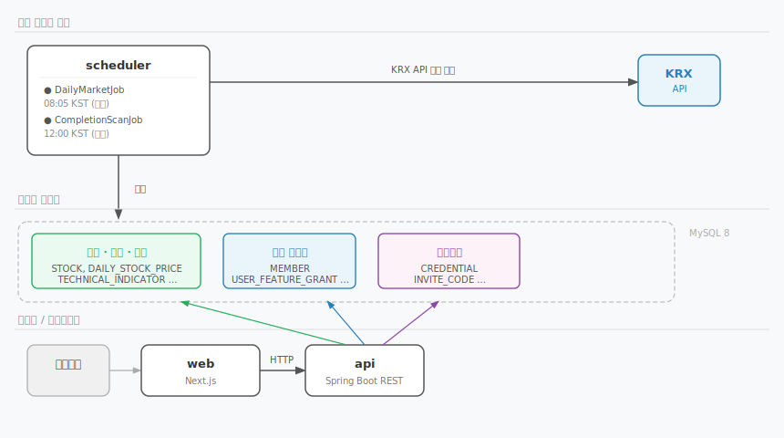

# dove-lab

다양한 기능의 집합체.
귀찮은 무언가 있다면? 조금이라도 편해지고 싶다.

한없이 게으른 자를 위한 프로젝트

## 시스템 구조



1. **scheduler**: 매일 08:05 KST에 KRX에서 종목·주가를 직접 수집하고 기술지표를 계산한다. 12:00에는 누락 데이터를 전체 이력 기준으로 보정한다.
2. **api**: REST API 서버 — 회원 인증 + 주식 데이터 조회 + 사용자 기능 권한 관리
3. **web**: Next.js 기반 UI

## 프로젝트 구성

Spring Boot 3 / Java 21. 헥사고날(Ports & Adapters) 멀티모듈, DDD 전술 패턴.

```
application/                Driver adapter — Spring Boot 실행 단위
  scheduler                 @Scheduled 진입점 — 수집·지표 계산·보정 일괄 처리
  api                       REST API 서버 (port 8081)

domain/                     Aggregate 단위 모듈 (entity + repository + CQRS service)
  auth                      Credential, InviteCode
  user                      MemberProfile, MemberRole
  user-feature              UserFeatureGrant, UserModuleDisplay, UserFeatureDisplay
  market                    MarketType, MarketTradingDate
  stock                     Stock, DailyStockPrice
  indicator                 TechnicalIndicator + 지표 계산기
  screening                 사용자 정의 종목 필터 + 종목 세트 + 지표 프리셋

infrastructure/             Driven adapter
  krx                       KRX API 어댑터 (Feign) + DailyMarketData 타입
  security                  JwtProvider, JwtFilter, AuthenticatedUser

library/
  jpa                       JpaConfig, QuerydslConfiguration
  logging                   logback 공통 설정
```

## 프론트엔드 구조 (Next.js App Router)

```
web/src/
  app/           라우팅. Server Component로 데이터 fetch → containers에 props 전달
  containers/    기능(메뉴) 단위 폴더
    dashboard/
    stock-search/
      main/        /stock-search
      filters/     /search-filters
      stock-sets/  /stock-sets
    settings/
    admin/
    root/
  components/    공통 컴포넌트 (여러 기능에서 재사용)
  app/api/       Next.js API 라우트 — JWT 쿠키를 Authorization 헤더로 변환하는 백엔드 프록시
  services/      외부 통신 (backendFetch, clientFetch)
  utils/         순수 함수 유틸 (cx, jwt, filter)
  types/         타입 정의
```

## 애플리케이션별 문서

각 애플리케이션의 환경변수·로컬 실행·테스트 방법은 아래 README를 참고한다.

| 앱 | 문서 |
|---|---|
| scheduler | [application/scheduler/README.md](./application/scheduler/README.md) |
| api | [application/api/README.md](./application/api/README.md) |

## 사전 준비

### Java 21 설정

Java가 여러 버전 설치된 경우 Gradle이 사용할 JDK 경로를 `gradle.properties`에 지정한다.

```powershell
cp gradle.properties.example gradle.properties
```

`gradle.properties`를 열어 본인의 Java 21 경로를 입력한다.

```properties
# Windows
org.gradle.java.home=C:/Users/<username>/.jdks/corretto-21.x.x

# macOS / Linux
org.gradle.java.home=/Users/<username>/.jdks/corretto-21.x.x
```

> `gradle.properties`는 `.gitignore`에 등록되어 레포에 올라가지 않는다.

**빌드 실행**

```bash
# Linux / macOS
./gradlew clean build
```

```powershell
# Windows — gradlew.bat 은 시스템 JAVA_HOME 만 읽으므로 gw.ps1 을 사용한다.
# gw.ps1 은 gradle.properties 에서 경로를 읽어 JAVA_HOME 을 자동 설정한다.

# 최초 1회 — 스크립트 실행 권한 허용
Set-ExecutionPolicy -Scope CurrentUser -ExecutionPolicy RemoteSigned

.\gw.ps1 clean build
.\gw.ps1 :api:bootRun
```

## 로컬 실행

### 1. 인프라 기동

```bash
# 기존 컨테이너·볼륨 정리 (최초 실행 또는 DB 초기화가 필요한 경우)
docker compose -f docker-compose.local.yml down -v --remove-orphans

# MySQL 기동
docker compose -f docker-compose.local.yml up -d
```

> `-v` 플래그는 MySQL 데이터 볼륨까지 삭제한다.
> DB는 유지하고 컨테이너만 재시작할 때는 `-v` 없이 실행.

### 2. DB 초기 데이터

`docker-entrypoint-initdb.d`는 볼륨이 비어 있을 때 한 번만 실행된다.
`docker-compose.local.yml`에 마운트된 파일로 제어한다.

| 파일 | 내용 | 기본 포함 |
|---|---|---|
| `scripts/init.sql` | 스키마 DDL | ✅ |
| `scripts/init_data.sql` | 로컬 개발용 사용자 계정 (비밀번호: `1234`) | ✅ |
| `scripts/init_stock_data.sql` | 종목·주가·기술지표 mock 데이터 | 주석 처리 시 제외 가능 |

종목 데이터가 불필요하면 `docker-compose.local.yml`에서 `init_stock_data.sql` 마운트 줄을 주석 처리한다.

**로컬 개발 계정 (비밀번호 공통: `1234`)**

| username | name | role |
|---|---|---|
| `manager` | 관리자 | ADMIN |
| `alice` | Alice | USER |
| `bob` | Bob | USER |
| `charlie` | Charlie | USER |

### 3. 애플리케이션 실행

각 앱의 상세 실행 방법은 앱별 README를 참고한다.

```bash
# Linux / macOS — api
INIT_ADMIN_USERNAME=admin INIT_ADMIN_PASSWORD=<pw> ./gradlew :api:bootRun

# Linux / macOS — scheduler (상세 옵션은 application/scheduler/README.md 참고)
KRX_API_AUTH_KEY=<key> ./gradlew :scheduler:bootRun
```

```powershell
# Windows — api
$env:INIT_ADMIN_USERNAME="admin"; $env:INIT_ADMIN_PASSWORD="<pw>"; .\gw.ps1 :api:bootRun

# Windows — scheduler (상세 옵션은 application/scheduler/README.md 참고)
$env:KRX_API_AUTH_KEY="<key>"; .\gw.ps1 :scheduler:bootRun
```

### 4. web (Next.js)

```bash
cd web

# 최초 실행 시 의존성 설치
npm install

# 환경변수 설정
cp .env.example .env.local
# INTERNAL_API_URL 기본값: http://localhost:8081

# 개발 서버 실행 (http://localhost:3000)
npm run dev
```

## 운영 배포

[docker-compose.prod.yml.example](./docker-compose.prod.yml.example)을 복사하여
`<...>` 자리에 실제 값을 채운다.

```bash
cp docker-compose.prod.yml.example docker-compose.prod.yml

# 스키마 초기화 (최초 1회)
mysql -u <user> -p <DB명> < scripts/init.sql

# 서비스 기동
docker compose -f docker-compose.prod.yml up -d
```

> 운영 DB에는 `init_data.sql`, `init_stock_data.sql`을 **실행하지 않는다.**
> 스키마(`init.sql`)만 적용하고 데이터는 수집 파이프라인이 채운다.

## scripts/

| 파일 | 설명 |
|---|---|
| `init.sql` | 스키마 DDL (단일 진실 원천) |
| `init_data.sql` | 로컬 개발용 사용자 시드 |
| `init_stock_data.sql` | 로컬 개발용 종목·주가·기술지표 mock |
