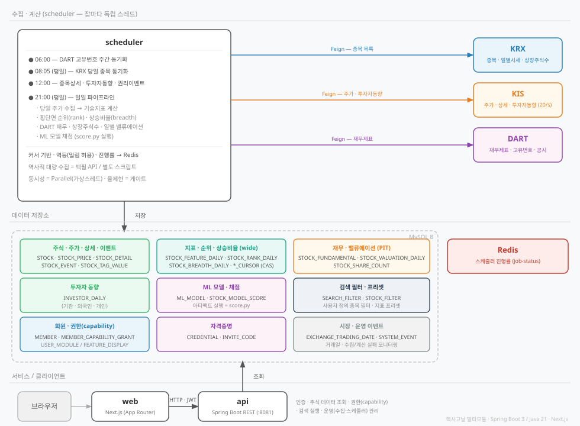

# dove-lab

다양한 기능의 집합체.
귀찮은 무언가 있다면? 조금이라도 편해지고 싶다.

한없이 게으른 자를 위한 프로젝트

## 시스템 구조



1. **scheduler**: 잡마다 독립 스레드로 — KRX 당일 종목 동기화(08:05), KIS 종목 상세·투자자동향 수집(12:00), 거래소별 당일 주가 수집(21:00), 커서 기반 기술적 지표 계산(00:00). 역사적 수집은 ROOT 전용 백필 API(비동기, 재조회 ≤어제). 진행률은 ROOT 대시보드로 조회.
2. **api**: REST API 서버 — 회원 인증 + 주식 데이터 조회 + 사용자 기능 권한 관리 + 운영(수집·스케줄러) 관리
3. **web**: Next.js 기반 UI

## 프로젝트 구성

Spring Boot 3 / Java 21. 헥사고날(Ports & Adapters) 멀티모듈, DDD 전술 패턴.

```
application/                Driver adapter — Spring Boot 실행 단위
  scheduler                 @Scheduled 진입점 — 수집·지표 계산·보정 일괄 처리
  api                       REST API 서버 (port 8081)

domain/                     Aggregate 단위 모듈 (entity + repository + CQRS service)
  auth                      Credential, InviteCode
  user                      MemberProfile, MemberRole
  user-feature              UserFeatureGrant, UserModuleDisplay, UserFeatureDisplay
  market                    Exchange, ExchangeTradingDate, MarketListingSync
  stock                     Stock, StockDetail, StockEvent(권리이벤트), StockPrice(RAW·ADJUSTED), StockTagValue
  stock-collection          KIS 주가·권리이벤트(KSD)·투자자동향 수집 코어 + 백필 런처(CollectionLauncher)
  indicator                 StockFeatureDaily(지표 wide 저장) + 지표 계산기 + IndicatorCursor(그룹 단위 CAS)
  screening                 사용자 정의 종목 필터 + 종목 세트 + 지표 프리셋
  investor-flow             종목별 투자자 매매동향 (기관·외국인·개인)
  system-event              수집·계산 운영 이벤트 기록 (ROOT 모니터링)

infrastructure/             Driven adapter
  krx                       KRX API 어댑터 (Feign)
  kis                       KIS API 어댑터 (Feign) + KisGate (초당 20회 율제한)

library/
  jpa                       JpaConfig, QuerydslConfiguration
  logging                   logback 공통 설정
  concurrent                Parallel (가상 스레드 동시 수 제한)
  api-quota / datetime      공통 API 할당량 / 날짜 유틸
  job-status                스케줄러 진행률 레지스트리 (Redis)
```

## 애플리케이션별 문서

각 애플리케이션의 환경변수·로컬 실행·테스트 방법은 아래 README를 참고한다.

| 앱 | 문서 |
|---|---|
| scheduler | [application/scheduler/README.md](./application/scheduler/README.md) |
| api | [application/api/README.md](./application/api/README.md) |

## 사전 준비

### Java 21 설정

Java가 여러 버전 설치된 경우 Gradle이 사용할 JDK 경로를 `gradle.properties`에 지정한다.

```powershell
cp gradle.properties.example gradle.properties
```

`gradle.properties`를 열어 본인의 Java 21 경로를 입력한다.

```properties
# Windows
org.gradle.java.home=C:/Users/<username>/.jdks/corretto-21.x.x

# macOS / Linux
org.gradle.java.home=/Users/<username>/.jdks/corretto-21.x.x
```

> `gradle.properties`는 `.gitignore`에 등록되어 레포에 올라가지 않는다.

**빌드 실행**

```bash
# Linux / macOS
./gradlew clean build
```

```powershell
# Windows — gradlew.bat 은 시스템 JAVA_HOME 만 읽으므로 gw.ps1 을 사용한다.
# gw.ps1 은 gradle.properties 에서 경로를 읽어 JAVA_HOME 을 자동 설정한다.

# 최초 1회 — 스크립트 실행 권한 허용
Set-ExecutionPolicy -Scope CurrentUser -ExecutionPolicy RemoteSigned

.\gw.ps1 clean build
.\gw.ps1 :api:bootRun
```

## 로컬 실행

### 1. 인프라 기동

```bash
# 기존 컨테이너·볼륨 정리 (최초 실행 또는 DB 초기화가 필요한 경우)
docker compose -f docker-compose.local.yml down -v --remove-orphans

# MySQL 기동
docker compose -f docker-compose.local.yml up -d
```

> `-v` 플래그는 MySQL 데이터 볼륨까지 삭제한다.
> DB는 유지하고 컨테이너만 재시작할 때는 `-v` 없이 실행.

### 2. DB 초기 데이터

`docker-entrypoint-initdb.d`는 볼륨이 비어 있을 때 한 번만 실행된다.
`docker-compose.local.yml`에 마운트된 파일로 제어한다.

| 파일 | 내용 | 기본 포함 |
|---|---|---|
| `scripts/init.sql` | 스키마 DDL | ✅ |
| `scripts/init_data.sql` | 로컬 개발용 사용자 계정 (비밀번호: `1234`) | ✅ |
| `scripts/init_stock_data.sql` | 종목·주가·기술지표 mock 데이터 | 주석 처리 시 제외 가능 |

종목 데이터가 불필요하면 `docker-compose.local.yml`에서 `init_stock_data.sql` 마운트 줄을 주석 처리한다.

**로컬 개발 계정 (비밀번호 공통: `1234`)**

| username | name | role |
|---|---|---|
| `manager` | 관리자 | ADMIN |
| `alice` | Alice | USER |
| `bob` | Bob | USER |
| `charlie` | Charlie | USER |

### 3. 애플리케이션 실행

각 앱의 상세 실행 방법은 앱별 README를 참고한다.

```bash
# Linux / macOS — api
INIT_ADMIN_USERNAME=admin INIT_ADMIN_PASSWORD=<pw> ./gradlew :api:bootRun

# Linux / macOS — scheduler (상세 옵션은 application/scheduler/README.md 참고)
KRX_API_AUTH_KEY=<key> ./gradlew :scheduler:bootRun
```

```powershell
# Windows — api
$env:INIT_ADMIN_USERNAME="admin"; $env:INIT_ADMIN_PASSWORD="<pw>"; .\gw.ps1 :api:bootRun

# Windows — scheduler (상세 옵션은 application/scheduler/README.md 참고)
$env:KRX_API_AUTH_KEY="<key>"; .\gw.ps1 :scheduler:bootRun
```

### 4. web (Next.js)

```bash
cd web

# 최초 실행 시 의존성 설치
npm install

# 환경변수 설정
cp .env.example .env.local
# INTERNAL_API_URL 기본값: http://localhost:8081

# 개발 서버 실행 (http://localhost:3000)
npm run dev
```

## 운영 배포

[docker-compose.prod.yml.example](./docker-compose.prod.yml.example)을 복사하여
`<...>` 자리에 실제 값을 채운다.

```bash
cp docker-compose.prod.yml.example docker-compose.prod.yml

# 스키마 초기화 (최초 1회)
mysql -u <user> -p <DB명> < scripts/init.sql

# 서비스 기동
docker compose -f docker-compose.prod.yml up -d
```

> 운영 DB에는 `init_data.sql`, `init_stock_data.sql`을 **실행하지 않는다.**
> 스키마(`init.sql`)만 적용하고 데이터는 수집 파이프라인이 채운다.

### 데이터 마이그레이션 (1회성)

기존 운영 스키마에 손으로 적용하는 마이그레이션. 멱등(재실행 안전)이며 도커 기동 시 자동 실행되지 않는다.

`EXCHANGE_TRADING_DATE`(거래소 개장일)를 거래일 목록 조회의 출처로 전환 — 과거 거래일을 `STOCK_PRICE`에서 역추출해 채운다.

```bash
mysql -u <user> -p <DB명> < scripts/migration/backfill_exchange_trading_date.sql
```

> 백필 이후의 거래일은 `DailyPriceJob`이 매 거래일 자동 등록한다.
> 백필은 `STOCK_PRICE`가 EXCHANGE/PRICE_TYPE를 enum ordinal(TINYINT)로 저장하는 것을 전제로 한다 — PriceType.RAW=0, StockExchange KOSPI=0/KOSDAQ=1/KONEX=2.

## scripts/

| 파일 | 설명 |
|---|---|
| `init.sql` | 스키마 DDL (단일 진실 원천) |
| `init_data.sql` | 로컬 개발용 사용자 시드 |
| `init_stock_data.sql` | 로컬 개발용 종목·주가·기술지표 mock |
| `migration/*.sql` | 운영용 1회성 수동 마이그레이션 (멱등, 자동 실행 X) |

### 신규 지표 추가 절차

1. **코드**: `IndicatorType`에 값 추가 → Calculator 작성 → `TechnicalIndicatorConfig`에 빈 등록 → `StockFeatureDaily`에 컬럼(필드 + `set()`/`toIndicatorMap()` 케이스) 추가 → `init.sql`의 `STOCK_FEATURE_DAILY`에 컬럼 추가.
2. **스키마 반영**: 운영 DB는 `ALTER TABLE STOCK_FEATURE_DAILY ADD COLUMN <컬럼> FLOAT;` (MySQL 8 nullable 컬럼은 INSTANT — 즉시).
3. **과거 채우기**: 커서를 비우면 다음 배치가 1985년부터 전 그룹을 재계산하며 새 컬럼을 채운다.
   ```sql
   TRUNCATE TABLE INDICATOR_CURSOR;   -- 전 종목 전체 재계산 (수동 1회)
   ```
   - 전체 재계산 비용 = 약 1,500만 행 재기록(로컬 약 30-60분 / 운영 약 1-3시간). 신규 지표는 가끔 있는 일이라 허용한다.
   - 일부만(예: ADJUSTED만) 재계산하려면 WHERE가 되는 `DELETE`(또는 `clearAdjusted`)를 쓴다.
4. **지표 배치 실행** → 새 컬럼이 채워진다. 이후 일일 배치는 새 날짜만 계산(수 분).

> `TRUNCATE`는 즉시 커밋(롤백 불가)이라 의도적으로 전체 재계산할 때만 쓴다.
> 앱 코드에서는 native SQL 금지이므로 `repository.deleteAllInBatch()`를 사용한다.

## Docker 메모리 설정

`docker-compose.prod.yml.example`에 메모리 한계가 미리 설정되어 있다.
8GB 서버 기준 권장값:

| 서비스 | 컨테이너 한계 | JVM/Node 힙 설정 |
|--------|-------------|-----------------|
| scheduler | 1,536 MB | `-Xmx1100m -XX:+UseZGC` |
| api | 1,024 MB | `-Xmx700m -XX:+UseG1GC` |
| web | 768 MB | `--max-old-space-size=512` |
| MySQL | 2,560 MB | `innodb_buffer_pool_size=1536M` |

> JVM/Node 힙 옵션은 각 `Dockerfile`의 `JAVA_TOOL_OPTIONS` / `CMD` 에 이미 적용되어 있다.